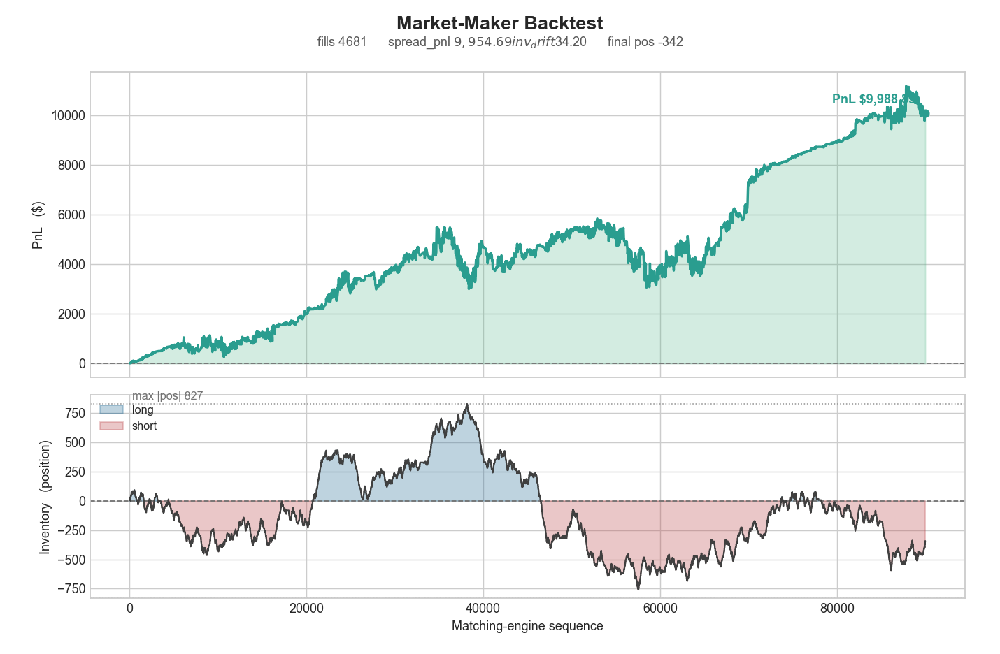

# Limit Order Book · Matching Engine · Backtester

[](https://github.com/jack-ferney/Matching_Engine/actions/workflows/ci.yml)
[](LICENSE)


A from-scratch **limit-order-book matching engine** in modern C++20, paired with a
**Python execution-analytics layer** that drives the engine over a CSV protocol and
measures a market-maker's PnL honestly. Built to exchange-grade correctness rules
(strict **price–time priority**, integer-tick pricing, four order types) and
benchmarked at **~2 million `submit()`/second single-threaded** with **~280 ns
median** latency (p99 ≈ 1.5 µs) on a commodity laptop.

---

## TL;DR

| | |
|---|---|
| **Engine** | C++20, header/impl split, zero third-party deps in the hot path |
| **Matching** | Price–time priority; executes at the **resting** price; Limit / Market / IOC / FOK |
| **Core structures** | `std::map` price levels · `std::list` FIFO queues · `unordered_map` id index |
| **Hot-path complexity** | O(1) top-of-book · O(1) cancel/reduce · O(log L) level insert |
| **Throughput** | **~2.0 M orders/s** (median of 12 runs, single-threaded) |
| **Latency** | **p50 ≈ 280 ns · p99 ≈ 1.5 µs · p99.9 ≈ 6.6 µs** (TSC-timed) |
| **Tests** | **75 total** — 31 GoogleTest (engine) + 44 plain-assert (Python tooling) |
| **Tooling** | Synthetic-flow generator · signed-position backtester · open-loop market-maker · matplotlib visualizer |

---

## Table of contents
- [What this is](#what-this-is)
- [Architecture](#architecture)
- [Design decisions & data-structure tradeoffs](#design-decisions--data-structure-tradeoffs)
- [Order types & matching semantics](#order-types--matching-semantics)
- [Performance](#performance)
- [Build & run](#build--run)
- [The replay protocol](#the-replay-protocol)
- [Python execution-analytics layer](#python-execution-analytics-layer)
- [Testing](#testing)
- [Repository layout](#repository-layout)
- [Non-goals & simplifications](#non-goals--simplifications)

---

## What this is

A **matching engine** is the core of any exchange: it maintains the *order book*
(all resting buy/sell interest) and, when a new order arrives, decides what trades
to execute and at what prices. The non-negotiable rule is **price–time priority**:
better-priced orders match first, and at equal price the order that arrived first
matches first.

This engine implements that faithfully:

- **Integer-tick pricing.** Prices are `std::int64_t` ticks, never `double`. A
  matching engine does nothing but compare and order prices millions of times a
  second; floating point can't represent most decimal ticks exactly, so `0.1 + 0.2`
  problems turn into silent mismatched-fill bugs. Integers make every comparison
  exact. The Python layer converts to dollars only for human-facing output.
- **Execution at the resting price.** When a buy at 105 crosses a resting ask at
  100, the trade prints at **100** — the passive order set the terms and the
  aggressor gets price improvement.
- **A deterministic logical clock.** "Time" for priority is an engine-stamped
  monotonic sequence number assigned on arrival, not wall-clock time — portable,
  exact, and reproducible.

The engine is a static library (`me`); a thin **replay CLI** bridges it to a
Python tooling layer over a dead-simple CSV protocol.

---

## Architecture

```
            Python execution analytics (tools/)                 C++ engine (src/, include/me/)
   ┌──────────────────────────────────────────────┐       ┌────────────────────────────────────────┐
   │  generator.py / strategy.py                    │       │  apps/replay.cpp  (CSV in → CSV out)     │
   │    synthetic order flow + open-loop MM quotes  │       │        │                                 │
   │                                                │ orders │        ▼                                 │
   │                                                │ ─────► │   MatchingEngine                         │
   │                                                │  CSV   │     ├─ submit() : match, then rest       │
   │                                                │        │     ├─ cancel() / reduce()  (O(1))       │
   │  backtester.py   visualizer.py                 │ ◄───── │     └─ OrderBook                          │
   │    signed PnL,    equity + inventory PNG       │ trades │          ├─ bids:  map<Price,…,greater>  │
   │    spread/drift   spread-vs-drift title strip  │  CSV   │          ├─ asks:  map<Price,…,less>     │
   └──────────────────────────────────────────────┘        │          ├─ level: list<Order> (FIFO)    │
                                                            │          └─ index: unordered_map<id,loc> │
                                                            └────────────────────────────────────────┘
```

**Why a CSV bridge rather than pybind11 bindings?** A stdin/stdout CSV contract is
language-agnostic, trivially testable (`echo` a few lines in), and lets either side
be swapped or rewritten independently — the fast C++ core stays a pure matching
engine, the flexible Python side does generation and analysis. pybind11 is the
known alternative; it couples the two at the ABI and adds build complexity this
project doesn't need.

---

## Design decisions & data-structure tradeoffs

| Concern | Choice | Why it's the right tool |
|---|---|---|
| **Sorted price levels** | `std::map<Price, PriceLevel, Cmp>` | The best price is always `begin()` → **O(1) top-of-book**; a new level is **O(log L)** to insert (L = distinct price levels, small in practice). |
| **Best bid *and* best ask in O(1)** | `std::greater` for bids, `std::less` for asks | With these comparators `begin()` is the best price on **both** sides — no special-casing in the hot loop. |
| **Time priority within a level** | `std::list<Order>` (FIFO) | `front()` is the oldest = first to fill. Crucially, `std::list` iterators stay valid across other insert/erase — which is what makes the id index possible. |
| **O(1) cancel / reduce** | `unordered_map<OrderId, Location>` | A `Location{side, price, list-iterator}` lets cancel/reduce reach the exact node and `erase` it in **O(1)** — no scanning the book. |
| **O(1) depth query** | cached `Quantity total_qty` per level | "How much rests here?" is a field read, not a walk of the list, kept in sync on every insert/erase. |
| **Exact prices** | `int64_t` ticks | Exact equality and ordering; no floating-point drift in the one operation the engine does constantly. |
| **Deterministic priority** | engine-stamped `Seq` | A monotonic arrival counter is the canonical, portable notion of "who was first." |

One deliberate coupling: `MatchingEngine` is a `friend` of `OrderBook` so the
matching loop can mutate the level maps and the id index directly on the hot path,
rather than going through a defensive public API. It's a conscious
encapsulation-for-speed tradeoff, contained to one well-understood seam.

**Auditability.** Every `submit` returns a `SubmitResult` accounting for the full
incoming quantity as `filled + resting + cancelled` (plus a `rejected` flag for a
killed FOK). Every tick is accounted for, which makes the behavior testable to the
unit.

---

## Order types & matching semantics

| Type | Behavior |
|---|---|
| **LIMIT** | Cross the opposite side while the price allows, then **rest** the remainder in the book. |
| **MARKET** | Cross at any price until filled or the book is empty; **never rests** — any remainder is cancelled. |
| **IOC** (immediate-or-cancel) | Take whatever is available right now; cancel the remainder; never rests. |
| **FOK** (fill-or-kill) | **All-or-nothing.** A read-only `fillable_quantity` pre-check runs *before* any mutation; if the full size can't be filled, the order is rejected with **zero** trades and the book untouched. |

The FOK pre-check is the subtle one: it makes fill-or-kill **atomic**. Matching
first and discovering insufficient liquidity later would leave phantom partial
fills; computing fillability against a `const` view of the book and only then
proceeding guarantees no partial prints.

---

## Performance

### Methodology

`bench/bench_engine.cpp` measures throughput and latency in **two separate passes**
so neither perturbs the other. N randomized limit orders are pre-generated **before**
timing (RNG/construction excluded); the price band is deliberately tight
(9,900–10,100) so a large fraction of orders **cross**, exercising the matching path.

- **Throughput** — a clean loop over a fresh engine, timed once with `steady_clock`
  (no per-op instrumentation in the way).
- **Latency** — a second pass timing each `submit()` with the x86 **invariant TSC**
  (`__rdtscp`), not `steady_clock` (which quantizes to ~100 ns on Windows and would
  floor every sample). TSC ticks are calibrated to nanoseconds, and the cost of the
  two TSC reads themselves is measured and subtracted from every sample.
- **Workload:** N = 2,000,000, seeded (`mt19937_64`, 12345), 50/50 buy/sell, qty
  1–100. ~22% of orders rest (final book = 433,300 every run — fully deterministic).
- **Protocol:** 1 warm-up run discarded, then **12 measured runs** via
  [`scripts/bench.ps1`](scripts/bench.ps1).
- **Build / host:** g++ 15.2, C++20, optimized (`-O2`/`-O3` + `-DNDEBUG`),
  single-threaded; AMD Ryzen AI 5 340 laptop, Windows 11.

### Results (12 runs)

| Metric | Median | Mean ± sd |
|---|---:|---:|
| **Throughput** | **2.01 M orders/s** | 1.98 M ± 0.10 M |
| Latency **p50** | 280 ns | 286 ns |
| Latency **p99** | 1.47 µs | 1.49 µs |
| Latency **p99.9** | 6.6 µs | 8.5 µs |

Mean `submit` time (1 / throughput) is ≈ 500 ns while the median is 280 ns — the gap
is the right-skewed allocation tail.

> **Read these as a relative baseline, not a hardware spec.** This is a single-threaded
> run on a *laptop*, where CPU boost/thermal state swings throughput materially (the
> TSC here calibrates to ~2.0 GHz — the base clock, i.e. no boost). The value is the
> **before/after** delta once the optimization pass lands, not the absolute number.

### Why percentiles, not just an average

Tail latency is what matters in trading: a great mean with an ugly p99.9 means
occasional stalls — typically a heap allocation or a container rebalance — and the
slow order is often the one that matters. The gap between p50 (~280 ns) and p99.9
(~6.6 µs) is the per-order allocation tail, which is exactly what the planned
optimization pass (object pool / flat-array levels) targets.

> **Reproduce:** `cmake -S . -B build -G Ninja && cmake --build build`, then
> `.\scripts\bench.ps1` (Windows) or `./scripts/bench.sh` (Linux).

---

## Build & run

### Prerequisites
- CMake ≥ 3.20, a C++20 compiler (g++ ≥ 10; built with g++ 15.2), Ninja (recommended).
- Python 3 with `matplotlib` + `numpy` (only for `visualizer.py`); the rest of the
  tooling is standard-library only.

### Configure, build, test (Windows / PowerShell)
```powershell
cmake -S . -B build -G Ninja            # first-time configure (fetches GoogleTest once)
cmake --build build                     # incremental build
ctest --test-dir build --output-on-failure   # run all engine tests
.\build\unit_tests.exe --gtest_filter='Match.*'   # run a subset
```

### Run the binaries
```powershell
.\build\demo.exe                               # tiny end-to-end walkthrough, printed by eye
.\scripts\bench.ps1                            # averaged throughput + latency percentiles
cmd /c "build\replay.exe < apps\sample1.csv"   # CSV orders -> CSV trades
```
> On PowerShell 5.1, drive the replay CLI with `cmd /c "exe < in > out"` rather than
> `Get-Content in | exe | Set-Content out` — the PowerShell pipe re-encodes the
> byte stream and can corrupt the engine's input.

### Linux / macOS / WSL
Identical, with `./build/<name>` and `python3`. CI-style one-liner:
```bash
cmake -S . -B build -G Ninja -DCMAKE_BUILD_TYPE=Release && cmake --build build && ctest --test-dir build --output-on-failure
```

---

## The replay protocol

`apps/replay.cpp` is the bridge. It reads orders on **stdin** and writes trades on
**stdout**, both CSV — no CSV library needed.

**Input** (`id,side,type,price,qty`), one per line; a header line is tolerated:
```
id,side,type,price,qty
1,S,LIMIT,100,5
2,B,LIMIT,100,5
```
- `side` = `B`/`S`; `type` = `LIMIT|MARKET|IOC|FOK` (price ignored for `MARKET`).
- A **cancel** is the row `id,,CANCEL,,` — it retracts that resting order.

**Output** (`aggressor_id,resting_id,price,qty,seq`), one per trade:
```
aggressor_id,resting_id,price,qty,seq
2,1,100,5,2
```

This contract is what makes the C++ core and Python analytics independently
testable and swappable.

---

## Python execution-analytics layer

The point of this layer is **faithful measurement on top of a real matching
engine**, not a fabricated PnL curve — the exact maturity signal quant desks screen
for. Four scripts in [`tools/`](tools/) (tests in [`tools/tests/`](tools/tests/)):

- **[`generator.py`](tools/generator.py)** — synthetic order flow: a random-walk
  mid, side-aware passive/aggressive placement, weighted order types, and random
  FIFO cancellation of resting passives. `--n/--seed/--out`.
- **[`backtester.py`](tools/backtester.py)** — a `Backtester` that replays
  `trades.csv` and tracks **one trader's signed position and cash**. You register
  which order ids are yours (`register` / `register_from(mm.csv)`); each fill folds
  into cash/position by **signed quantity**. Its headline output is the honest
  decomposition `summary()` reports:
  - `spread_pnl` — inventory marked at the *first* price seen → **pure spread
    capture**,
  - `inv_drift` — everything else → the P&L swing from **carrying inventory** while
    the price moved,
  - plus `max_abs_position` and an aggressive/passive fill-volume split.

  Splitting earned spread from inventory drift is what stops a lucky price move
  being reported as edge.
- **[`strategy.py`](tools/strategy.py)** — an **open-loop** market-maker that
  generates an order file. The mid follows a **2-state Markov volatility regime**
  (calm/stormy) so volatility *clusters*, and quotes are **vol-scaled**
  (`eff_spread = spread + round(k·σ)` over a rolling window). A quote machine
  cancels its prior quotes and re-posts around the mid each cycle, emitting an
  orders CSV plus an `id,side` sidecar for the backtester.
- **[`visualizer.py`](tools/visualizer.py)** — a two-panel matplotlib PNG: the
  **equity curve in dollars** (gains/losses shaded) over the signed **inventory
  path** (long/short shaded, ±max-position envelope), with the spread/drift split
  in the title strip.

**Full pipeline (Windows):**
```powershell
python tools\strategy.py --n 75000 --seed 2026 --spread 25 --k 2 --out_orders order.csv --out_mm mm.csv
cmd /c "build\replay.exe < order.csv > trades.csv"
python tools\backtester.py trades.csv --mm mm.csv
python tools\visualizer.py trades.csv --mm mm.csv --out docs\pnl.png
```



*Sample output (4,681 MM fills over a 75k-order session). The title strip splits PnL
into `spread_pnl` (spread captured) and `inv_drift` (P&L from carried inventory) —
here drift dwarfs spread, which is exactly the open-loop limitation noted below.*

> **Known limitation (by design).** This pipeline is **open-loop**: the MM writes
> its whole order file before `replay` runs, so it never sees a fill in time to
> react and therefore can't skew on inventory — its PnL is spread capture plus
> zero-mean inventory drift. Closing that loop (an inventory-aware Avellaneda–
> Stoikov quoter over an interactive protocol) is the next milestone.

---

## Testing

**75 tests total**, all green:

- **31 GoogleTest** cases over the engine ([`tests/`](tests/)) — the tests *are* the
  spec: execution at the resting price, lowest-ask-first price priority,
  oldest-first time priority, multi-level sweeps, market/IOC/FOK semantics, the FOK
  atomic pre-check, and O(1) cancel/reduce edge cases.
- **44 plain-`assert` Python tests** ([`tools/tests/`](tools/tests/)) —
  backtester sign convention and the spread/drift split (19), the strategy quote
  machine and vol regime (17), and the generator's type weighting and FIFO cancel
  (8). No pytest dependency: `python tools\tests\test_strategy.py`.

```powershell
ctest --test-dir build --output-on-failure
python tools\tests\test_backtester.py; python tools\tests\test_strategy.py; python tools\tests\test_generator.py
```

CI runs all of this on every push — a Release build + `ctest`, a separate
**ASan/UBSan** job, and the Python tooling tests
([`.github/workflows/ci.yml`](.github/workflows/ci.yml)).

---

## Repository layout

```
include/me/      public headers (declarations), namespace `me`
src/             implementations → static lib `me`
tests/           GoogleTest suites (Sanity, Match, Book)
apps/            demo.cpp · replay.cpp (CSV bridge) · sample CSVs
bench/           bench_engine.cpp (throughput + latency percentiles)
tools/           Python analytics; tests in tools/tests/
scripts/         bench.ps1 / bench.sh — averaged benchmark harness
docs/            generated figures (pnl.png)
.github/         CI: build + ctest + ASan/UBSan + Python tooling tests
CMakeLists.txt   build (lib `me`, demo, replay, bench, unit_tests via FetchContent)
.clang-format · .clang-tidy
```

---

## Non-goals & simplifications

Scoping is deliberate; these are known omissions, not oversights:

- **Single-threaded core.** No concurrency yet. The scaling path is per-symbol
  sharding plus a single-writer ring buffer (LMAX-Disruptor style) feeding the
  matching thread — the current engine is the single-threaded core that pattern wraps.
- **Synthetic flow, not market data.** The generator and strategy produce stylized
  order flow; this project measures *mechanics and cost accounting*, not alpha.
- **No self-trade prevention, fees/rebates, or pro-rata matching.** Pure price–time
  priority; those are venue-specific policies layered on top in production.
- **Order modification is reduce-only.** A size *increase* correctly loses queue
  priority, so it is modeled as cancel/replace rather than in place.
- **Open-loop strategy.** The market-maker cannot yet skew on inventory; the
  closed-loop, inventory-aware version (Avellaneda–Stoikov over an interactive
  protocol) is the next milestone.